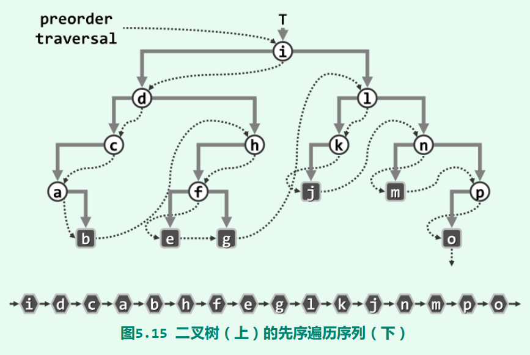
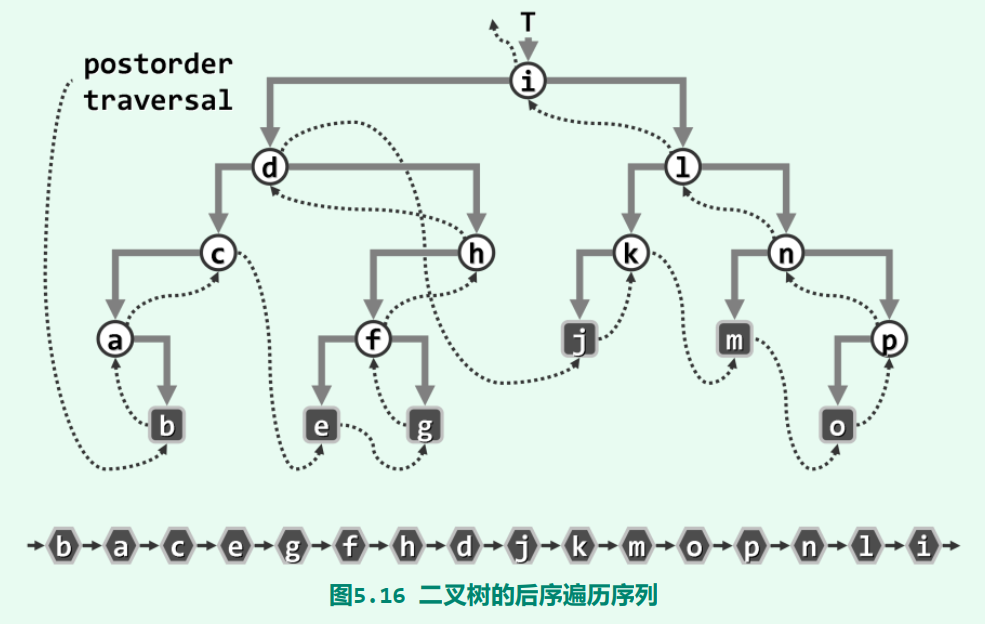
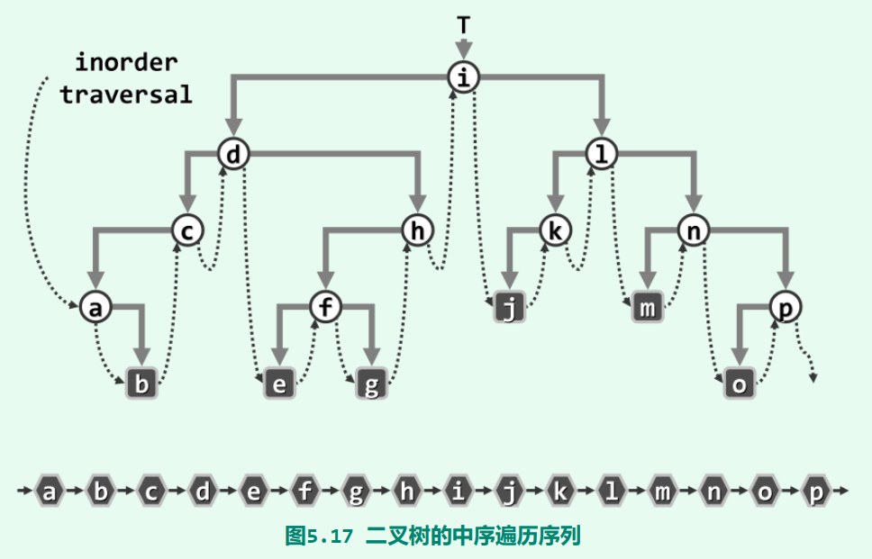

# DSA-self-learning

2022 summer

https://dsa.cs.tsinghua.edu.cn/~deng/ds/dsacpp/index.htm

## Confusion:

### Vector:

- `struct Increase` in [`Vector_realization.h`](./Vector_realization.h).
- `Vector<T>::merge` in [`Vector_realization.h`](./Vector_realization.h).
- [`Vector_partition.h`](./Vector_partition.h).

### List:

- `List<T>::merge` and `List<T>::radixSort` in [`List_realization.h`](./List_realization.h).
- [`List_reverse.h`](./List_reverse.h).

### Stack:

- Chapter 4.4 试探回溯法.

### BinTree:

- traverse in `BinNode_trav****.h`.

### BST(Binary Search Tree):

- removeAt in [`BST_realization.h`](./BST_realization.h).

## Tips & Attention:

- **C++ templates should be placed in the header file!!!**
- divide and conquer.
- Shifting instead of multiplying/dividing by 2.
- `ListNode<T>::insertAsPred` in [`ListNode_insert.h`](./ListNode_insert.h).
- `List<T>::remove` in [`List_realization.h`](./List_realization.h).
- [`BinNode_macro`](./BinNode_macro.h)  useful.
- Template class inheritance required `this->` or `ClassName<T>::`.

## Figures:

- traverse

